# AttendEase — Enterprise Product Architecture & Technical Blueprint

> **System Version:** 2.0.0 (Phase 5 Complete)  
> **Architecture Pattern:** Multi-Tenant Modular Monolith with Asynchronous Queue Workers  
> **Last Updated:** 2026-08-16  

---

## 1. Executive Summary & Product Vision

**AttendEase** is an enterprise-grade, multi-tenant SaaS Academic ERP (Enterprise Resource Planning) platform designed specifically for educational institutions (universities, colleges, institutes, and academic centers). It streamlines institutional operations by replacing fragmented spreadsheets and manual registers with a unified, role-based, real-time web application.

### Key Capabilities & Domains Covered
1. **Academic Hierarchy & Structure Management** — Organization of Courses, Branches, Semesters, Subjects, and Sections with automated student promotion and graduation workflows.
2. **Timetable Generation & Conflict Resolution** — Day × Slot timetable grid creation with multi-level conflict detection (teacher, section, room).
3. **Attendance Management & Background Aggregation Engine** — Class-slot attendance capture, proxy detection (IP & device fingerprinting), offline queue sync, SMS fallback parsing, and real-time background statistical aggregation.
4. **Exams, Invigilation & Grade Management** — Date × Shift exam scheduling grid (Shifts I–IV), teacher invigilation duty assignment (max 2, overlap detection), custom enterprise exam structures, and student grade/result tracking.
5. **Fee Structure & Billing Lifecycle** — Program tuition structures, automated fee generation, student self-payment portal integration (Razorpay), collection receipts, and fee waivers.
6. **Multi-Tenant SaaS Engine & Feature Gating** — Dynamic plan-based module gating (`attendance`, `exams`, `fees`, `timetable`, `academic`, `calendar`, `alerts`, `reports`, `parent_portal`, `exam_structure`), tenant branding tokens, subscription billing, and usage quota enforcement.
7. **Custom Role-Based Access Control (RBAC)** — Granular `module:action` permissions, custom organizational roles, and multi-tenant security boundaries.

---

## 2. High-Level System Architecture

AttendEase is structured as a single-repo monolith separating **Backend REST API services** and **Frontend Single Page Application (SPA)** with asynchronous background processing powered by **Redis Bull Queues**.

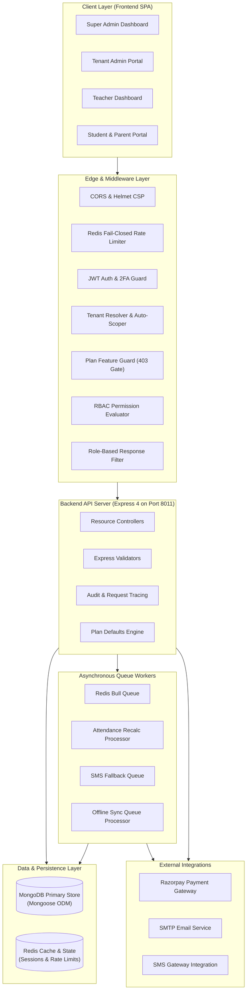

---

## 3. Multi-Tenancy Architecture & Data Isolation

Multi-tenancy in AttendEase is enforced at the **application layer** using a single database, shared collection model with strict **tenant ID scoping**.

### 3.1 Tenant Resolution Pipeline
Every incoming HTTP request goes through the `tenantResolver` middleware:

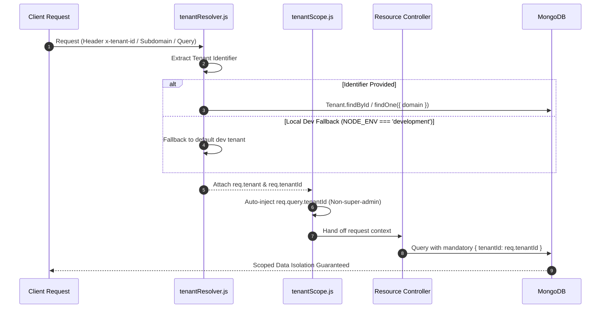

### 3.2 Key Multi-Tenant Rules
- **No Client Spoofing:** For non-`super_admin` users, any client-supplied `tenantId` in body or query parameters is stripped and replaced with `req.user.tenantId`.
- **Super Admin Support Mode:** `super_admin` accounts bypass automatic tenant scoping, enabling global cross-tenant administration, plan setup, and support monitoring.
- **Cache Isolation:** Cache keys in Redis are strictly namespaced: `tenant:${tenantId}:*` and `user:${userId}:*`. Invalidation triggers on write operations to preserve consistency.

---

## 4. Security, Auth & RBAC Architecture

### 4.1 Authentication & Token Rotation Engine
AttendEase uses a dual-token security architecture with short-lived access tokens and rotated refresh tokens:

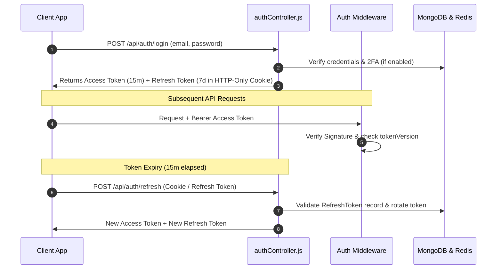

### 4.2 Multi-Layer Middleware Authorization Stack
Every incoming endpoint call passes through a standardized multi-tier middleware pipeline:

```mermaid
flowchart LR
    A["Request"] --> B["1. requestIdMiddleware\n(Attach X-Request-ID)"]
    B --> C["2. apiLogger / auditLogger\n(Track IP, User-Agent, Path)"]
    C --> D["3. authenticateToken\n(Decode JWT & User context)"]
    D --> E["4. autoFilterUserResponses\n(Strip unprivileged user fields)"]
    E --> F["5. authorizeRoles / adminAuth / superAdminAuth\n(Check primary role)"]
    F --> G["6. requirePermission\n(Check granular customRole)"]
    G --> H["7. featureGuard\n(Validate Tenant Plan Module)"]
    H --> I["8. require2FA / idempotency\n(Sensitive actions check)"]
    I --> J["9. Controller Execution"]
```

### 4.3 Permission & Plan Feature Matrix
- **Permissions (`CustomRole.permissions`):** Resource-action strings like `attendance:mark`, `exams:create`, `fees:collect`, `timetable:edit`.
- **Plan Feature Gates (`featureGuard`):** If a tenant's plan lacks a feature (e.g., `exam_structure`), the request halts immediately with `403 Forbidden` and `{ upgradeRequired: true }`.

---

## 5. Billing, Subscriptions & Feature Gating System

### 5.1 Plan Hierarchy & Defaults Engine
Plan modules and limits are defined in [backend/utils/planDefaults.js](file:///c:/Users/Parth%20Manocha/Desktop/DEV/attendease_/backend/utils/planDefaults.js). This serves as the authoritative source of truth:

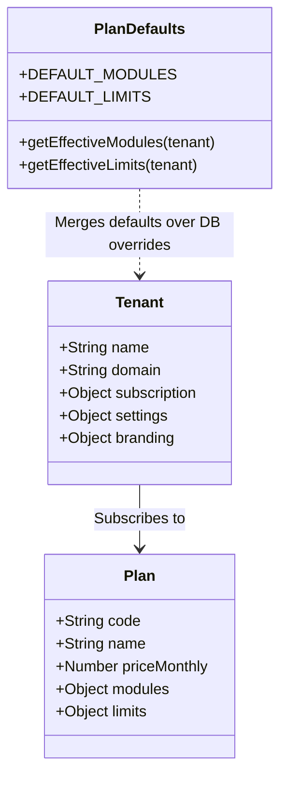

### 5.2 Razorpay Integration & Upgrade UX Flow
1. **Frontend Gate Trigger:** User attempts to access a locked feature or receives a 403 `upgradeRequired` error.
2. **Upgrade Modal:** `useUpgradeModal` opens `PricingModal.jsx` presenting plan tiers (Basic, Professional, Enterprise).
3. **Order Creation:** Frontend calls `POST /api/billing/create-subscription-order`. Backend interacts with Razorpay API.
4. **Checkout & Verification:** User completes payment on Razorpay modal; frontend calls `POST /api/billing/verify-payment`.
5. **Real-time Activation:** Tenant subscription status is updated to `active`, module overrides update instantly, and frontend state refreshes without a hard browser reload.

---

## 6. Core Module Architecture & Domain Workflows

### 6.1 Academic Hierarchy & Promotion Engine
The academic core models institutional hierarchy: `Course` → `Branch` → `Semester` → `Subject` → `Section`.

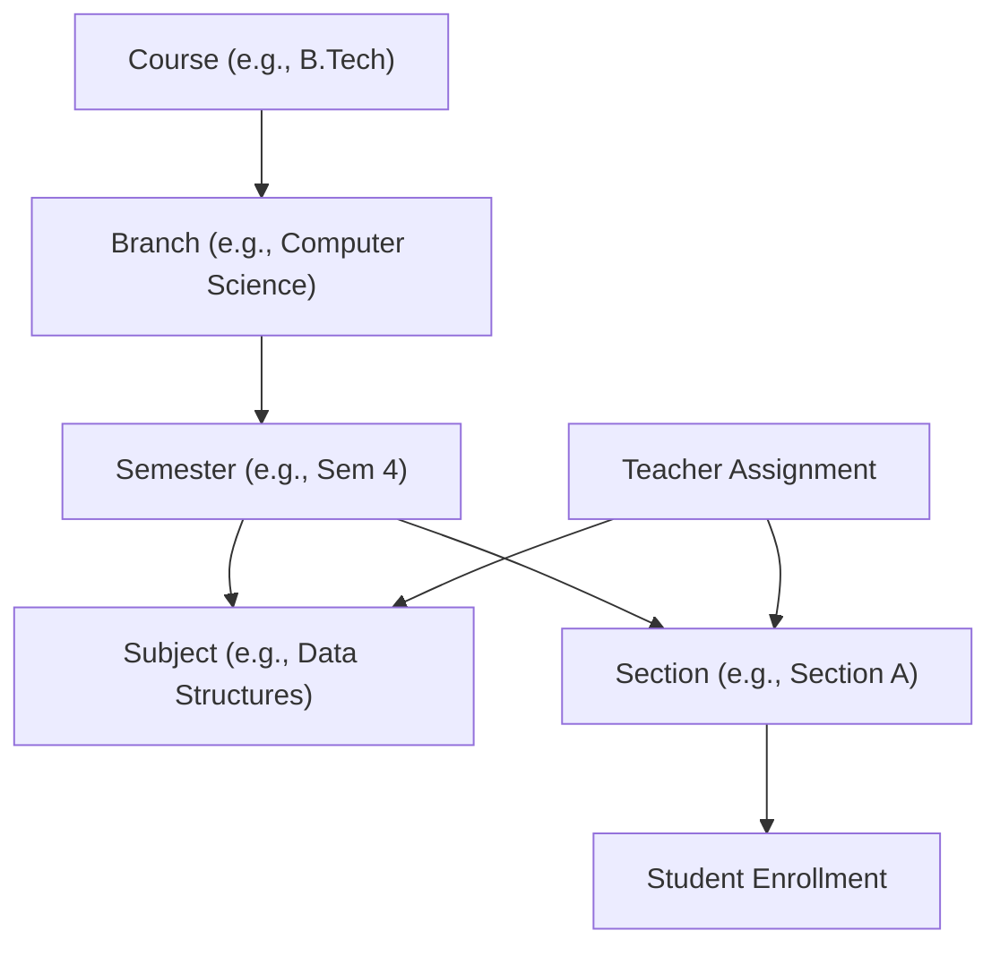

- **Promotion Workflow:** Admins preview promotion eligibility for a batch of students. Students are upgraded to the next semester or marked as `graduated`. Blockers (such as fee arrears or hold status) can freeze individual promotions.

### 6.2 Timetable Generation & Conflict Resolution Engine
Timetables use a Day × Time Slot grid per Section. The conflict detector verifies three invariants:

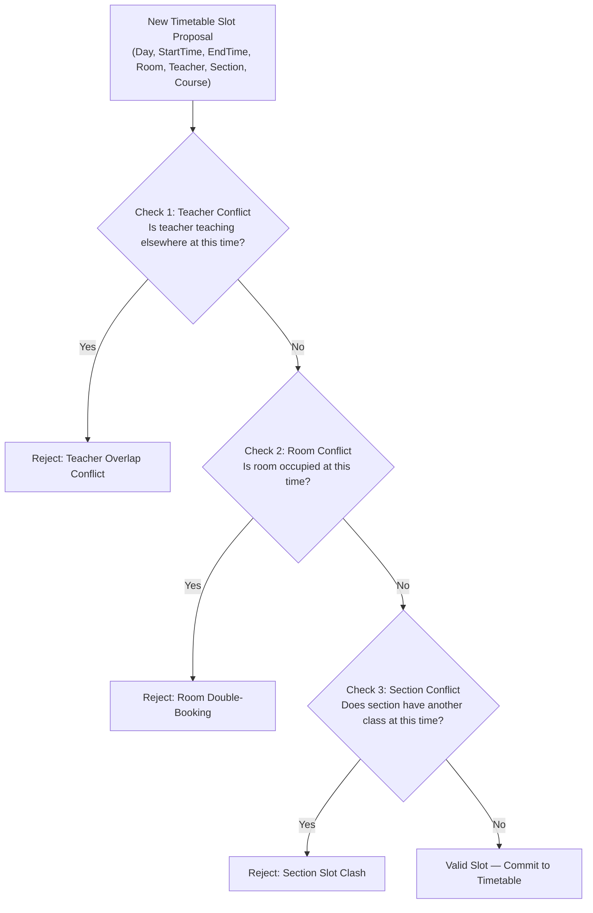

### 6.3 Attendance Capture, Offline Sync & Background Worker Architecture
Attendance capture handles high-frequency daily entries from teachers, including offline network resilience and SMS emergency submissions.

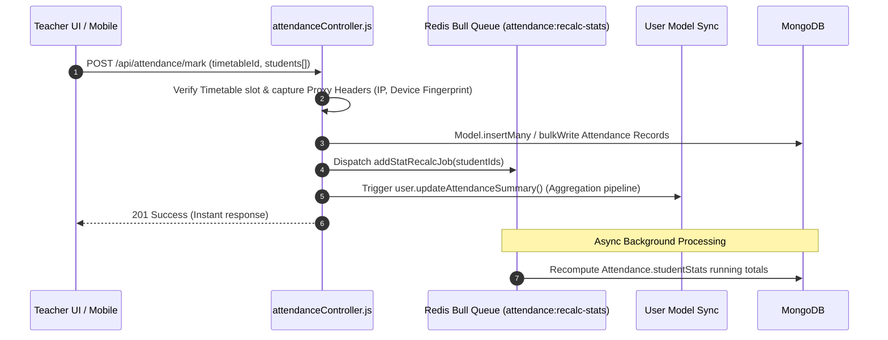

- **Offline Sync & SMS Fallback:** In low connectivity zones, attendance payloads accumulate in `syncQueue` (IndexedDB / LocalStore) and auto-sync when online. Emergency SMS payloads are received, parsed by the SMS worker, validated against pre-approved teacher numbers, and committed.

### 6.4 Exam System, Invigilation & Duty Allocation Grid
Exams operate on a Date × Shift grid (Shifts I through IV).

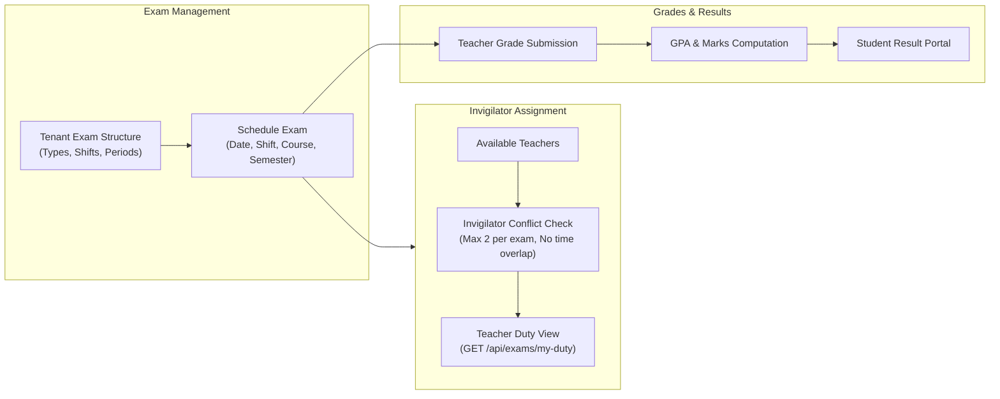

### 6.5 Fee Management & Automated Collection Flow
- **Course-Based Fee Structure:** Programs define baseline fee amounts (tuition, transport, hostel, other) per period (semester/annual).
- **Auto Generation:** Billing runs generate individual student `Fee` records for the upcoming term.
- **Payment & Receipts:** Students pay online via Razorpay or submit offline payments to admins. Transactions generate immutable `Transaction` logs and downloadable PDF receipts.

---

## 7. Database Architecture & Entity-Relationship Schema

The database model is implemented in MongoDB via Mongoose ODM schemas ([backend/models](file:///c:/Users/Parth%20Manocha/Desktop/DEV/attendease_/backend/models)).

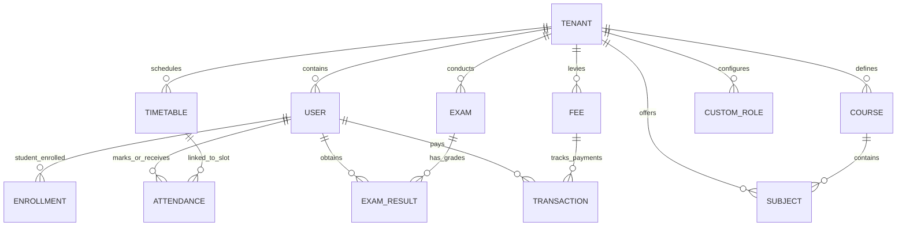

### 7.1 Data Collections Reference

| Collection | Schema File | Key Responsibilities & Key Fields |
|------------|-------------|-----------------------------------|
| `Tenant` | [Tenant.js](file:///c:/Users/Parth%20Manocha/Desktop/DEV/attendease_/backend/models/Tenant.js) | Org profile, `settings` (semesters, exams, shifts), `branding` (logo, colors), `subscription` (plan, status). |
| `User` | [User.js](file:///c:/Users/Parth%20Manocha/Desktop/DEV/attendease_/backend/models/User.js) | All accounts (`role`: super_admin/admin/teacher/student/parent), `attendance` summary, `assignedSubjects`, `tokenVersion`, 2FA. |
| `Plan` | [Plan.js](file:///c:/Users/Parth%20Manocha/Desktop/DEV/attendease_/backend/models/Plan.js) | SaaS plan tiers, prices, enabled `modules`, resource `limits`. Source of truth is merged with `planDefaults.js`. |
| `Course` | [Course.js](file:///c:/Users/Parth%20Manocha/Desktop/DEV/attendease_/backend/models/Course.js) | Academic programs, `branches[]`, duration, `feeStructure` (tuition total & period). |
| `Subject` | [Subject.js](file:///c:/Users/Parth%20Manocha/Desktop/DEV/attendease_/backend/models/Subject.js) | Course subjects, credits, semester mapping, `isActive`. |
| `Timetable` | [Timetable.js](file:///c:/Users/Parth%20Manocha/Desktop/DEV/attendease_/backend/models/Timetable.js) | Slot schedule: `day`, `startTime`, `endTime`, `room`, `teacherId`, `subjectId`, `section`, `isNoClass`. |
| `Attendance` | [Attendance.js](file:///c:/Users/Parth%20Manocha/Desktop/DEV/attendease_/backend/models/Attendance.js) | Per-student record: `date`, `status` (present/absent/leave), `timetableId`, proxy telemetry (`ipAddress`, `x-device-fingerprint`). |
| `Exam` | [Exam.js](file:///c:/Users/Parth%20Manocha/Desktop/DEV/attendease_/backend/models/Exam.js) | Exam slots: `date`, `shift` (I-IV), `examTypeCode`, `invigilators[]` (max 2), `maxMarks`, `passingMarks`. |
| `ExamResult` | [ExamResult.js](file:///c:/Users/Parth%20Manocha/Desktop/DEV/attendease_/backend/models/ExamResult.js) | Student grades: `marksObtained`, `grade`, `isAbsent`, `remarks`. |
| `Fee` | [Fee.js](file:///c:/Users/Parth%20Manocha/Desktop/DEV/attendease_/backend/models/Fee.js) | Student fee invoice: `amount`, `paidAmount`, `dueDate`, `status` (pending/partial/paid/waived), `type`. |
| `Transaction` | [Transaction.js](file:///c:/Users/Parth%20Manocha/Desktop/DEV/attendease_/backend/models/Transaction.js) | Payment log: `razorpayPaymentId`, `amount`, `paymentMethod`, `receiptUrl`. |
| `CustomRole` | [CustomRole.js](file:///c:/Users/Parth%20Manocha/Desktop/DEV/attendease_/backend/models/CustomRole.js) | Custom roles per tenant, array of `permissions`. |
| `AuditLog` | [AuditLog.js](file:///c:/Users/Parth%20Manocha/Desktop/DEV/attendease_/backend/models/AuditLog.js) | Security & compliance audit trail: actor, role, tenant, action, resource, IP, request ID. |
| `RefreshToken` | [RefreshToken.js](file:///c:/Users/Parth%20Manocha/Desktop/DEV/attendease_/backend/models/RefreshToken.js) | 7-day single-use rotated refresh tokens. |
| `APILog` | [APILog.js](file:///c:/Users/Parth%20Manocha/Desktop/DEV/attendease_/backend/models/APILog.js) | System execution performance & monitoring log. |

---

## 8. Frontend Architecture & Design System

The frontend application ([frontend/src](file:///c:/Users/Parth%20Manocha/Desktop/DEV/attendease_/frontend/src)) is a modern React 18 SPA built with standard component hierarchy and dynamic tenant design tokens.

### 8.1 Component Architecture & Routing Structure

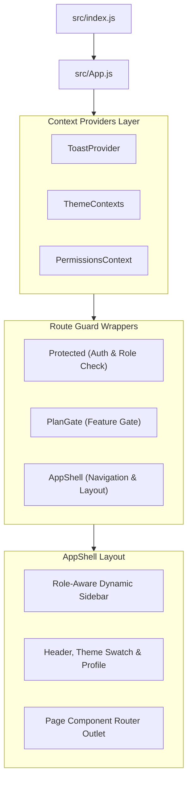

### 8.2 Dynamic Tenant Branding & Design Tokens
AttendEase features an institutional white-labeling theme engine:
- **Design Tokens:** Defined in `tailwind.config.js` using RGB-triplet CSS variables (`--color-primary`, `--color-secondary`, `--color-surface`, `--color-ink`, `--color-line`).
- **Dynamic Ingestion:** `ThemeContexts.jsx` fetches tenant branding colors from the API and dynamically writes CSS custom properties to the document root.
- **Hook Access:** Components consume theme values via `useThemeColors()`, ensuring consistent, accessible custom branding without re-compilation.

### 8.3 Shared UI Component Kit
Located at `frontend/src/component/common/ui/`:
- `Button` — Action triggers with variant, size, loading, and icon states.
- `Card` — Container elements with header, body, footer, and elevated styles.
- `Modal` & `PricingModal` — Accessibility-compliant overlays for dialogs and upgrade flows.
- `Table` & `Pagination` — Data grid displaying styled columns, sorting, and single-pass paginated navigation.
- `Badge` — Status indicator pills for active/inactive, attendance status, and payment states.
- `BulkImportModal` — Drag-and-drop CSV/XLSX file processor with format preview, error parsing, and batch upload triggers.

---

## 9. API Surface & Endpoint Map

The API is formally specified via OpenAPI 3.0 in [backend/docs/openapi.yaml](file:///c:/Users/Parth%20Manocha/Desktop/DEV/attendease_/backend/docs/openapi.yaml). Below is a summary of primary route handlers:

```
/api
├── /auth            (login, register, refresh, logout, 2FA, sessions, password-reset)
├── /admin           (teachers, assignments, bulk uploads, audit logs)
├── /academic        (courses, branches, semesters, promotion, graduation)
├── /subjects        (subject CRUD, teacher allocations)
├── /students        (student profiles, academic status, enrollment)
├── /attendance      (mark, timetable slots, history, stats, tickets, proxy detection)
├── /timetable       (grid view, slot CRUD, bulk import, conflict check)
├── /exams           (schedules, shifts, invigilation duties, grade submission, results)
├── /fees            (structures, fee generation, collecting, waivers, receipts, student self-pay)
├── /roles           (custom roles, granular permissions)
├── /tenants         (branding, settings, usage quotas)
├── /billing         (plans, razorpay orders, subscriptions, invoices)
├── /reports         (attendance, academic performance, financial exports)
├── /alerts          (announcements, broadcasting)
└── /support         (support tickets, reactivation)
```

---

## 10. Operations, Deployment & Quality Standards

### 10.1 Running locally

```bash
# 1. Start Backend API Server (Port 8011)
cd backend
# Ensure .env is populated with MONGO_URI, JWT_SECRET, REDIS_URL, etc.
node index.js

# 2. Seed Super Admin Account (if fresh database)
node seedAdmin.js

# 3. Start Frontend Development Server
cd ../frontend
npm start
```

### 10.2 Production Quality Verification Gates
All production code updates must strictly adhere to the following quality checks:
1. **Backend Syntax & Runtime Integrity:**
   ```bash
   node --check backend/index.js
   ```
2. **Frontend Production Build:**
   ```bash
   cd frontend && npm run build
   ```
3. **Linting Compliance:**
   ```bash
   cd frontend && npx eslint src/ --max-warnings 0
   ```
4. **Tenant Isolation Verification:** Automated isolation suite `__tests__/tenant-isolation.test.js` passing at 100%.

---

## 11. Cross-Reference Documentation

For detailed step-by-step developer guides and roadmap details, refer to:
- [CONTEXT.md](file:///c:/Users/Parth%20Manocha/Desktop/DEV/attendease_/CONTEXT.md) — Comprehensive Fast On-boarding & Conventions Guide.
- [Improvement.md](file:///c:/Users/Parth%20Manocha/Desktop/DEV/attendease_/Improvement.md) — Production Hardening & Completion Audit Log.
- [UPGRADE.md](file:///c:/Users/Parth%20Manocha/Desktop/DEV/attendease_/UPGRADE.md) — Phase-by-phase architectural refactoring plans.
